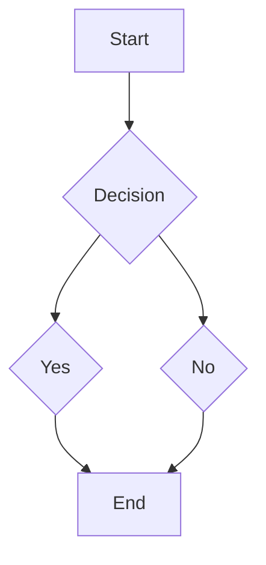

## Ref

```bash
# create .venv + install all deps from pyproject.toml / uv.lock
uv sync

# add a new runtime dependency (writes to pyproject.toml + uv.lock)
uv add <package>

# add a dev-only dependency (linting, notebooks, etc.)
uv add --dev <package>

# run a script inside the project's venv without manually activating it
uv run python ai.py

# run pylint via uv
uv run pylint $(git ls-files '*.py')

# refresh the lockfile after editing pyproject.toml by hand
uv lock
```

## Mermaid

