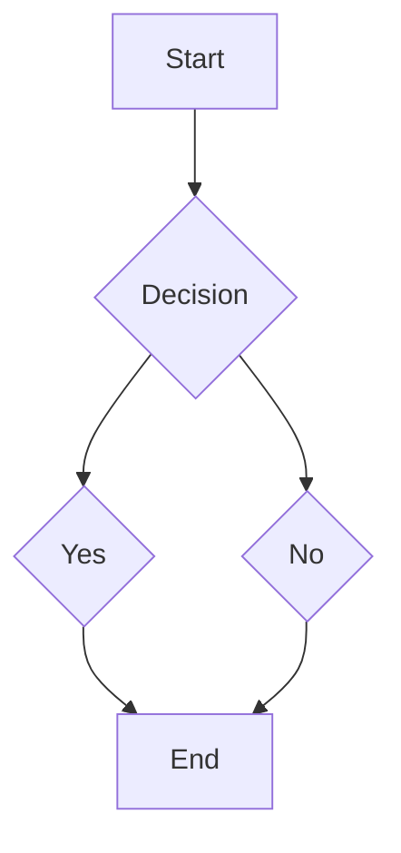

## Mermaid


```mermaid
graph TD;
    A[Start] --> B{Decision};
    B --> C{Yes};
    B --> D{No};
    C --> E[End];
    D --> E[End];
```

## Ref

```bash
python3 -m venv .venv

. .venv/bin/activate

pip freeze > requirements.txt

pip install -r requirements.txt
```